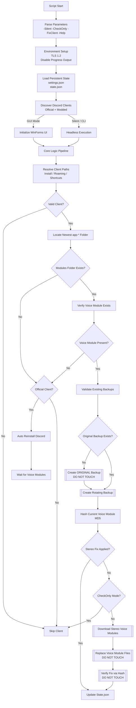

# DiscordVoiceFixer.ps1 — Complete Internal Documentation
(Architecture • Logic Flow • Source Walkthrough)

This document is intended for:
- Developers reading the source
- Auditors
- Modders
- People who are absolutely going to skid this code

This is NOT end-user documentation.

================================================================
HIGH-LEVEL EXECUTION FLOW (OVERVIEW)
================================================================

┌───────────────┐
│ Script Start  │
└───────┬───────┘
        │
        ▼
┌──────────────────────────────┐
│ Parse Parameters             │
│ -Silent / -CheckOnly / etc   │
└───────┬──────────────────────┘
        │
        ▼
┌──────────────────────────────┐
│ Environment Setup            │
│ - TLS 1.2                    │
│ - Disable progress spam      │
│ - Load WinForms (if GUI)     │
└───────┬──────────────────────┘
        │
        ▼
┌──────────────────────────────┐
│ Load Persistent State        │
│ - settings.json              │
│ - state.json                 │
└───────┬──────────────────────┘
        │
        ▼
┌──────────────────────────────┐
│ Discover Discord Clients     │
│ - Official + Modded          │
└───────┬──────────────────────┘
        │
        ├───────────────┐
        ▼               ▼
┌───────────────┐  ┌────────────────┐
│ Silent / CLI  │  │ GUI (WinForms) │
│ Mode          │  │ Wrapper        │
└───────┬───────┘  └────────┬───────┘
        │                   │
        ▼                   ▼
     CORE LOGIC (Shared for all modes)

================================================================
SECTION-BY-SECTION SOURCE WALKTHROUGH
================================================================

----------------------------------------------------------------
1. PARAMETER PARSING & MODE SELECTION
----------------------------------------------------------------

Accepted parameters:
- -Silent
- -CheckOnly
- -FixClient <index>
- -Help

Determines:
- UI vs headless execution
- Whether file writes are allowed
- Whether to target a specific client

No filesystem or process side effects occur here.

----------------------------------------------------------------
2. ENVIRONMENT INITIALIZATION
----------------------------------------------------------------

- Forces TLS 1.2 for GitHub + Discord endpoints
- Suppresses PowerShell progress output
- Loads WinForms + Drawing assemblies (GUI mode only)

This ensures deterministic behavior across Windows versions.

----------------------------------------------------------------
3. UI INITIALIZATION (OPTIONAL)
----------------------------------------------------------------

Defines a fully custom WinForms UI:
- Discord-style dark theme
- Custom fonts
- Styled buttons, labels, progress bar, console output

UI does NOT contain business logic.
It only calls core functions.

----------------------------------------------------------------
4. DISCORD CLIENT REGISTRY (CORE DATA MODEL)
----------------------------------------------------------------

Central ordered hashtable defining all supported clients.

Each client entry defines:
- Install paths
- Roaming paths
- Executable names
- Process names
- Shortcut fallbacks
- Modded vs official classification

This registry is the single source of truth for:
- Discovery
- Repair eligibility
- Backup naming
- Restore targeting

----------------------------------------------------------------
5. FILESYSTEM LAYOUT & PERSISTENT STATE
----------------------------------------------------------------

All script state lives under:

%APPDATA%\StereoInstaller

Structure:
- backups\
  - Rotating pre-fix backups
- original_discord_modules\
  - Permanent mono backups (never deleted)
- settings.json
  - User preferences
- state.json
  - Last fixed app version per client
- settings_backups\
  - EQ APO settings.json backups
- debug.log
  - Full execution trace

This design enables:
- Safe rollback
- Update detection
- Idempotent execution

----------------------------------------------------------------
6. LOGGING & SAFETY UTILITIES
----------------------------------------------------------------

Guarantees:
- All file writes are validated
- Disk space is checked before backups
- JSON schema migration on load
- Errors never hard-crash the script

Everything important is logged to debug.log.

----------------------------------------------------------------
7. CLIENT DISCOVERY & PATH RESOLUTION
----------------------------------------------------------------

For each registered client:

Resolution order:
1. Known install paths
2. Modded fallback paths
3. Running process inspection
4. Start Menu shortcut resolution

Then:
- Locate newest app-* directory (numeric version sort)
- Verify modules folder exists
- Verify discord_voice module exists

Results:
- Valid
- Missing voice module
- Corrupted install
- Not installed

----------------------------------------------------------------
8. CORRUPTION DETECTION
----------------------------------------------------------------

A client is marked corrupted if:
- app-* exists
- modules folder is missing
- client is official

Behavior:
- GUI: prompt user
- Silent: auto-repair

Modded clients are never auto-reinstalled.

----------------------------------------------------------------
9. AUTOMATIC DISCORD REINSTALL (OFFICIAL CLIENTS ONLY)
----------------------------------------------------------------

Flow:
Kill Discord processes
        ↓
Delete broken app-* directories
        ↓
Download correct installer
        ↓
Run installer
        ↓
Wait for voice module download
        ↓
Release file locks
        ↓
Resume fix pipeline

User data and login are preserved.

----------------------------------------------------------------
10. BACKUP CREATION PIPELINE
----------------------------------------------------------------

Before any modification:

┌──────────────────────────────┐
│ Original backup exists?      │
└───────────┬──────────────────┘
            │ No
            ▼
┌──────────────────────────────┐
│ Create ORIGINAL backup       │
│ (Permanent, never deleted)   │
└───────────┬──────────────────┘
            ▼
┌──────────────────────────────┐
│ Create rotating backup       │
│ (Pre-fix snapshot)           │
└──────────────────────────────┘

Backup validation requires:
- voice_module directory exists
- Contains .node or .dll files
- No zero-byte critical binaries

Invalid backups are discarded.

----------------------------------------------------------------
11. STEREO FIX APPLICATION
----------------------------------------------------------------

- Download voice modules from GitHub API
- Validate file size and integrity
- Replace voice_module contents

No binary patching.
No runtime injection.
Pure file replacement.

----------------------------------------------------------------
12. FIX VERIFICATION (HASH-BASED)
----------------------------------------------------------------

Uses MD5 hashes of discord_voice.node.

Comparison targets:
- Original mono backup
- Known stereo backup

States:
- Not fixed
- Fixed
- Unknown (no baseline yet)

No heuristics or version guessing.

----------------------------------------------------------------
13. EQ APO COMPATIBILITY FIX (OPTIONAL)
----------------------------------------------------------------

If enabled:
- Backup existing settings.json
- Download known-good settings.json
- Validate JSON structure
- Replace roaming settings.json

Backups are rotated and capped.

----------------------------------------------------------------
14. UPDATE DETECTION & AUTO-REAPPLY
----------------------------------------------------------------

- Read current app-* version
- Compare against state.json
- If version changed:
  - Reapply fix
  - Update state.json

Original mono backup is never overwritten.

----------------------------------------------------------------
15. RESTORE ENGINE
----------------------------------------------------------------

Supports restoring:
- Original mono state
- Any valid stereo backup

Flow:
Validate backup
        ↓
Wipe target voice_module
        ↓
Copy backup files
        ↓
Verify restore success

----------------------------------------------------------------
16. EXECUTION MODES
----------------------------------------------------------------

Silent mode:
- No UI
- Automatic repair allowed
- Logs + console output

CheckOnly mode:
- Read-only
- Reports corruption and fix status

----------------------------------------------------------------
SECURITY / TRUST MODEL
----------------------------------------------------------------

- No registry writes
- No system-wide hooks
- No runtime injection
- No Discord process patching
- Fully reversible file-level changes

If you skid this and break something,
that’s on you.

