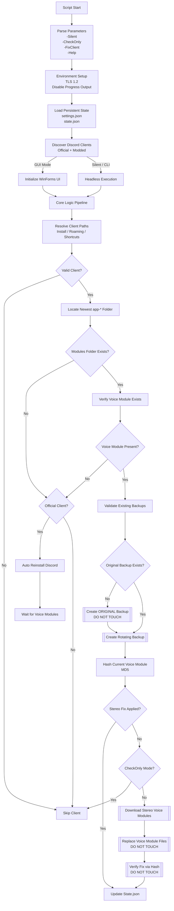

# DiscordVoiceFixer.ps1

## Internal Documentation

### Architecture • Logic Flow • Source Walkthrough

This document explains how the script works internally.

**Audience**

* Developers reading or modifying the source
* Auditors reviewing behavior and safety
* Modders and advanced users
* People who are absolutely going to skid this code

**Not end-user documentation.**

---

## 1. High-Level Execution Flow (Overview)

The script follows a deterministic, linear pipeline with optional UI wrapping.

**Primary stages:**

1. Parse parameters
2. Initialize environment
3. Load persistent state
4. Discover Discord clients
5. Execute shared core logic (GUI or headless)

GUI and Silent/CLI modes differ only in presentation. All business logic is shared.

---

## 2. Parameter Parsing & Mode Selection

**Accepted parameters:**

* `-Silent`
* `-CheckOnly`
* `-FixClient <index>`
* `-Help`

**Determines:**

* GUI vs headless execution
* Whether filesystem writes are allowed
* Whether a specific client is targeted

No filesystem, network, or process side effects occur at this stage.

---

## 3. Environment Initialization

Performed before any client interaction.

* Forces TLS 1.2 for GitHub and Discord endpoints
* Suppresses PowerShell progress output
* Loads WinForms and Drawing assemblies (GUI mode only)

Purpose: ensure consistent, deterministic behavior across Windows versions.

---

## 4. Optional UI Initialization (GUI Mode)

Defines a custom WinForms UI:

* Discord-style dark theme
* Custom fonts
* Styled buttons, labels, progress bar
* Embedded console output

**Important:**

* UI contains no business logic
* UI only calls shared core functions

---

## 5. Discord Client Registry (Core Data Model)

A central ordered hashtable defines all supported Discord clients.

Each client entry specifies:

* Install paths
* Roaming paths
* Executable names
* Process names
* Shortcut fallbacks
* Official vs modded classification

This registry is the single source of truth for:

* Client discovery
* Repair eligibility
* Backup naming
* Restore targeting

---

## 6. Filesystem Layout & Persistent State

All script data lives under:

```
%APPDATA%\StereoInstaller
```

**Directory structure:**

* `backups/`

  * Rotating pre-fix backups
* `original_discord_modules/`

  * Permanent mono backups (never deleted)
* `settings.json`

  * User preferences
* `state.json`

  * Last fixed app version per client
* `settings_backups/`

  * EQ APO settings.json backups
* `debug.log`

  * Full execution trace

Design goals:

* Safe rollback
* Update detection
* Idempotent execution

---

## 7. Logging & Safety Guarantees

The script guarantees:

* All file writes are validated
* Disk space is checked before backups
* JSON schema migration on load
* Errors never hard-crash execution

All significant actions are logged to `debug.log`.

---

## 8. Client Discovery & Path Resolution

For each registered client, resolution occurs in this order:

1. Known install paths
2. Modded fallback paths
3. Running process inspection
4. Start Menu shortcut resolution

After resolution:

* Newest `app-*` directory is selected (numeric version sort)
* `modules` folder is verified
* `discord_voice` module presence is checked

Each client is classified as:

* Valid
* Missing voice module
* Corrupted install
* Not installed

---

## 9. Corruption Detection Rules

A client is considered **corrupted** when:

* `app-*` directory exists
* `modules` folder is missing
* Client is official

**Behavior:**

* GUI mode: prompt user
* Silent mode: automatic repair

Modded clients are never auto-reinstalled.

---

## 10. Automatic Reinstall (Official Clients Only)

Reinstall flow:

1. Kill Discord processes
2. Delete broken `app-*` directories
3. Download official installer
4. Run installer
5. Wait for voice module download
6. Release file locks
7. Resume fix pipeline

User data and login state are preserved.

---

## 11. Backup Creation Pipeline

Before any modification:

1. Check for original mono backup
2. Create original backup if missing (permanent)
3. Create rotating pre-fix backup

**Backup validation requires:**

* `voice_module` directory exists
* Contains `.node` or `.dll` binaries
* No zero-byte critical files

Invalid backups are discarded.

---

## 12. Stereo Fix Application

* Downloads voice modules from GitHub API
* Validates file size and integrity
* Replaces `voice_module` contents

No binary patching.
No runtime injection.
Pure file replacement.

---

## 13. Fix Verification (Hash-Based)

Uses MD5 hashes of `discord_voice.node`.

Comparison targets:

* Original mono backup
* Known stereo backup

Possible states:

* Not fixed
* Fixed
* Unknown (no baseline)

No heuristics or version guessing.

---

## 14. EQ APO Compatibility Fix (Optional)

If enabled:

* Backup existing `settings.json`
* Download known-good configuration
* Validate JSON structure
* Replace roaming `settings.json`

Backups are rotated and capped.

---

## 15. Update Detection & Auto-Reapply

* Read current `app-*` version
* Compare against `state.json`
* If version changed:

  * Reapply fix
  * Update `state.json`

Original mono backups are never overwritten.

---

## 16. Restore Engine

Supports restoring:

* Original mono state
* Any valid stereo backup

Restore flow:

1. Validate backup
2. Wipe target `voice_module`
3. Copy backup files
4. Verify restore success

---

## 17. Execution Modes Summary

**Silent mode:**

* No UI
* Automatic repair allowed
* Logs and console output

**CheckOnly mode:**

* Read-only
* Reports corruption and fix status

---

## Security & Trust Model

* No registry writes
* No system-wide hooks
* No runtime injection
* No Discord process patching
* Fully reversible, file-level changes

If you skid this and break something,
that’s on you.

